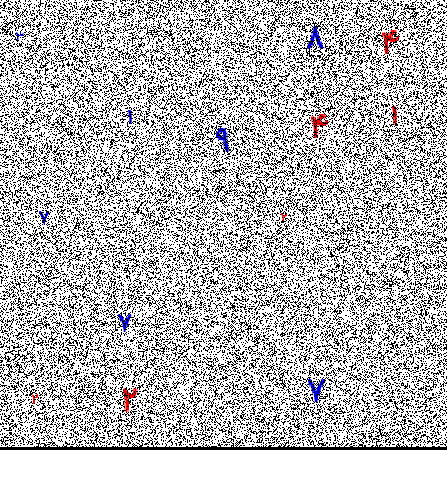
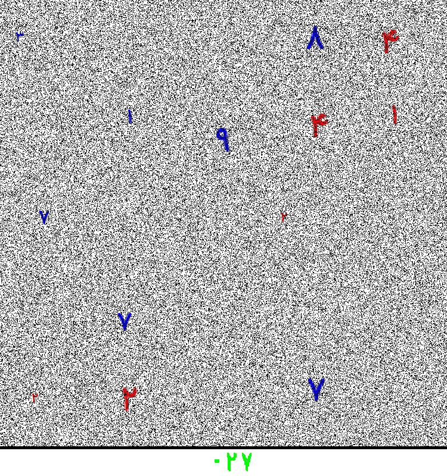

# Persian Number Extraction and Summation
My First Computer Vision Project :)

## Overview

This project aims to extract Persian numbers from images, sum them based on their color (red numbers are positive, blue numbers are negative), and overlay the result on the image in green. The dataset consists of 100 images with a white background, salt-and-pepper noise, and Persian numbers in red and blue. The goal is to preprocess these images, extract and classify the numbers, and display the computed sum on each image.

## Dataset

The dataset includes 100 images named in the format `Image_id_answer`, where:
- `id` is a unique identifier for the image.
- `answer` is the expected result of the sum of the Persian numbers in the image.

The images have:
- A white background.
- Salt-and-pepper noise with varying rates.
- Persian numbers in red and blue.

## Approach

1. **Noise Removal**: The code removes black pixels (salt-and-pepper noise) from the image.
2. **Gap Filling**: Missing regions in the image are filled based on neighboring pixels.
3. **Number Extraction**: Connected components in the image are identified, scaled, and centered.
4. **Template Matching**: Extracted numbers are compared with pre-defined templates to classify them.
5. **Summation**: Numbers are summed with red numbers treated as positive and blue numbers as negative.
6. **Overlay Result**: The final computed sum is overlaid on the image in green.

## Accuracy

The implemented method achieves an accuracy of 99% in extracting and summing the Persian numbers.

## Example

this is an input image example

and this is the output 

